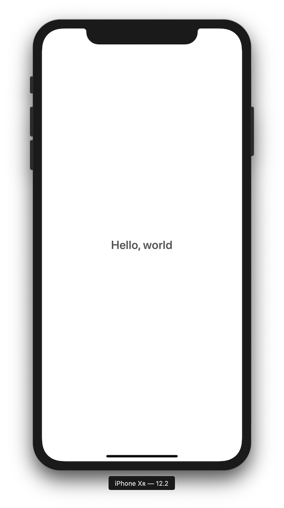
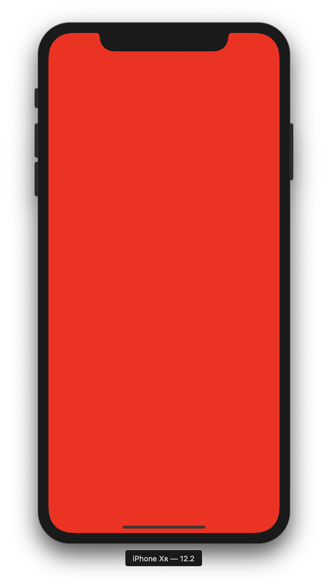

# Tutorial 1

## Using Blueprint in a View Controller

This tutorial will walk you through the basic setup required to create UI with Blueprint. This will also serve as the foundation for subsequent tutorials.

[Tutorial setup instructions](./Setup.md)

#### Goals

- Show a Blueprint Element hierarchy within a view controller
- Style a label to display a message on-screen



---

### Existing code

This tutorial starts off with a single source file: `AppDelegate.swift`. The app delegate is ready to go apart from one small detail: it has no view controller to show.

```swift
// window?.rootViewController =
```

### Create a view controller

1. In Xcode, select `File > New > File...`. 
2. Choose `Swift File`
3. Name the new file `ViewController.swift`
4. Place the file in `Tutorials/Tutorial 1`
5. Make sure the new source file is *only* added to the `Tutorial 1` target.

Add an empty view controller implementation for now:

```swift
// ViewController.swift

import UIKit

final class ViewController: UIViewController {

}

```

### Show the view controller

1. Open `Tutorial 1 > AppDelegate.swift`
2. Un-comment the line `// window?.rootViewController =` in the method `application(:didFinishLaunchingWithOptions:)`.
3. Assign a new instance of your view controller as the root view controller:

```swift
@UIApplicationMain
final class AppDelegate: UIResponder, UIApplicationDelegate {

    // ...

    func application(_ application: UIApplication, didFinishLaunchingWithOptions launchOptions: [UIApplication.LaunchOptionsKey: Any]?) -> Bool {

        window = UIWindow(frame: UIScreen.main.bounds)
        window?.rootViewController = ViewController()
        window?.makeKeyAndVisible()

        return true
    }

}
```

### Import Blueprint

Go back to `ViewController.swift`. In order to use Blueprint, we need to import it. We'll also import a companion library (`BlueprintUICommonControls`) that provides some primitive elements such as labels that we will use to build our UI.

```swift
// ViewController.swift

import UIKit
import BlueprintUI
import BlueprintUICommonControls
```

### Define a root element

We'll build fancier UI later, but for now we just want to make sure that our application works. `Box` is an element provided by `BlueprintUICommonControls` that supports background colors, borders, and rounded corners. We'll make one with a red background for now.

```swift
// ViewController.swift

let rootElement = Box(backgroundColor: .red)

```

### Add `BlueprintView` to `ViewController`

Blueprint element hierarchies are displayed within instances of `BlueprintView`. We'll add one to our view controller. The initializer takes an element to display as the only parameter, so we can pass in the root element that we created.

```swift
final class ViewController: UIViewController {

    private let blueprintView = BlueprintView(element: rootElement)

}
```

Now that we have a `BlueprintView` instance, we will use it as the view for this view controller. Override `loadView` and assign the blueprint view to `self.view`.

```swift
final class ViewController: UIViewController {

    private let blueprintView = BlueprintView(element: rootElement)

    override func loadView() {
        self.view = blueprintView
    }

}
```

Make sure `Tutorial 1` is selected as the active scheme, then run the app in Xcode. If everything worked, you should see a red screen.



### Adding "Hello, World"

Our app shows a red screen, which proves that Blueprint is on-screen and working. It's not a particularly nice UI, however, so we'll replace it with a message.

We previously defined the root element as a simple `Box`. We'll be doing a bit more customization this time, so we will define a *custom element*.

Custom elements have a few nice qualities:
- They are a unique type, with a unique name
- They can define their own initializers and properties

It is rare, however, for custom elements to do their own layout or view customization – they are typically assembled from other existing elements.

The `ProxyElement` protocol formalizes this pattern: conforming elements simply generate another element that will actually be displayed.

Let's see this in action:

Define a new element called `HelloWorldElement`:

```swift
// ViewController.swift

struct HelloWorldElement: ProxyElement {

    // this computed property returns another element that will be displayed.
    var elementRepresentation: Element {
        var label = Label(text: "Hello, world")
        label.font = .boldSystemFont(ofSize: 24.0)
        label.color = .darkGray

        return Centered(label)
    }

}
```

The element hierarchy that we have just defined is:

```
- Box
  - Centered
    - Label
```

Now update `ViewController` to use the new element:

```swift
final class ViewController: UIViewController {

    private let blueprintView = BlueprintView(element: HelloWorldElement())

    // ...

}
```

The app now displays "Hello, world" in bold white text, centered over a dark gray background.

Try rotating the simulator. Notice that the text is properly centered in both orientations, and it animates properly between orientations.

---

#### [Continue to Tutorial 2](./Tutorial2.md)