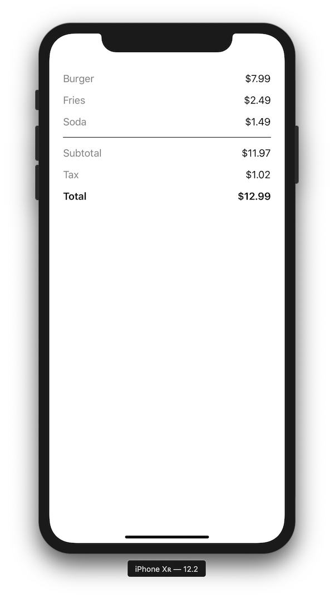
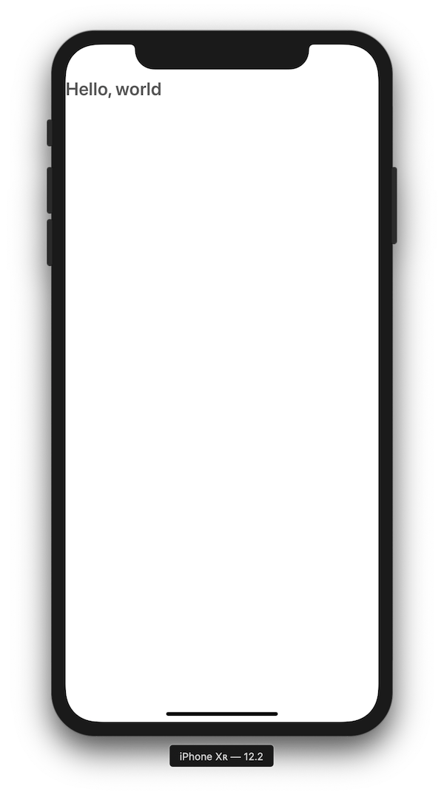
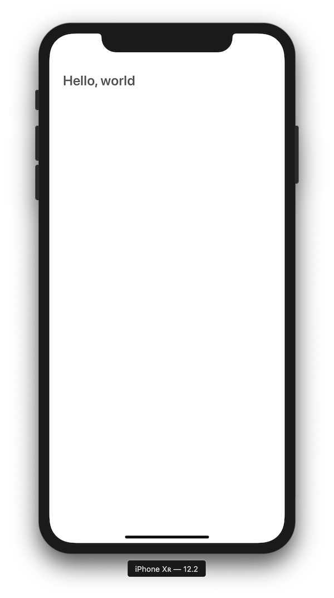
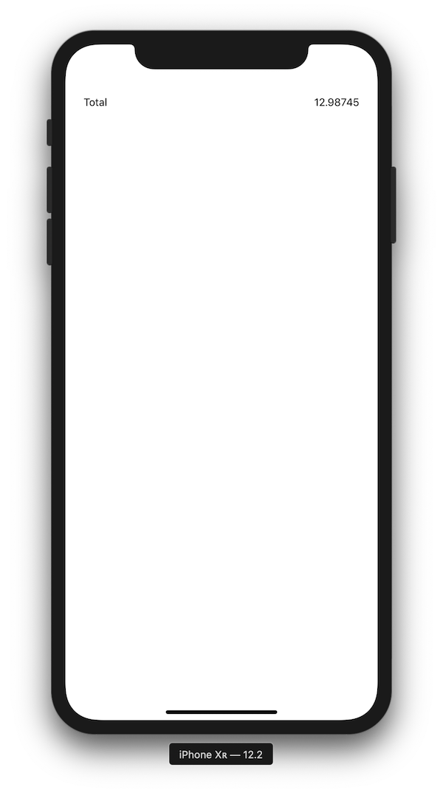
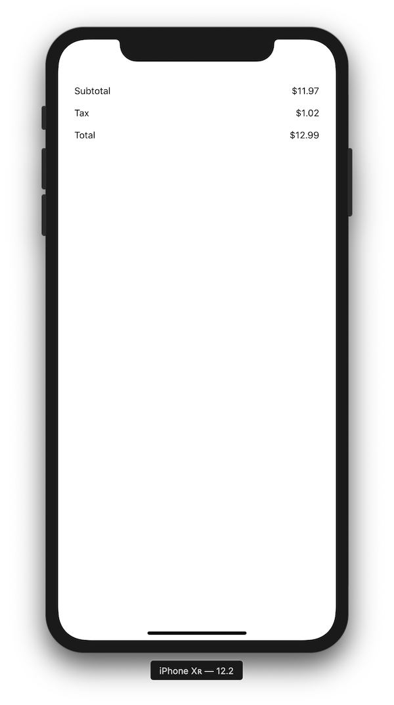

# Tutorial 2

## Building a receipt layout with Blueprint

This tutorial will build a receipt for a quick service restaurant.

[Tutorial setup instructions](./Setup.md)

#### Goals

- Show receipt information in a complex layout
- Use a few of the build-in element types from Blueprint



---

### Picking up from Tutorial 1

In Tutorial 1 we added Blueprint to a view controller, and created a new `HelloWorldElement` to display in it.

```swift
struct HelloWorldElement: ProxyElement {

    var elementRepresentation: Element {
        var label = Label(text: "Hello, world")
        label.font = .boldSystemFont(ofSize: 24.0)
        label.color = .darkGray

        return Centered(label)
    }

}
```

We'll be building a receipt layout in this tutorial. You can repurpose `HelloWorldElement` for this: just rename it to `ReceiptElement` and we'll continue from there.

### Making it scroll

Receipts can get pretty long, so we'll give this receipt the ability to scroll right off the bat.

Instead of returning `Centered(label)`, we'll make a `ScrollView` to display the label:

```swift
var scrollView = ScrollView(wrapping: label)
```

Next, we'll configure the `ScrollView and return it.

```swift
struct ReceiptElement: ProxyElement {

    var elementRepresentation: Element {
        var label = Label(text: "Hello, world")
        label.font = .boldSystemFont(ofSize: 24.0)
        label.color = .darkGray

        var scrollView = ScrollView(wrapping: label)
        scrollView.contentSize = .fittingHeight // Stretches content to fill width, but sizes height to fit
        scrollView.alwaysBounceVertical = true
        return scrollView
    }

}
```

If you run `Tutorial 2` in the simulator, you should be able to scroll vertically (though with a single label there is nothing to scroll just yet)



### Insetting content from the edge of the screen

So we now have a scrolling label, but it's jammed right up against the edge of the screen. We'll inset everything inside the `ScrollView` to make sure we have consistent padding.

We do this with the `Inset` element. We'll wrap the label in an `Inset` before we place it into the `ScrollView`.

```swift
struct ReceiptElement: ProxyElement {

    var elementRepresentation: Element {
        var label = Label(text: "Hello, world")
        label.font = .boldSystemFont(ofSize: 24.0)
        label.color = .darkGray

        let inset = Inset(
            wrapping: label,
            uniformInset: 24.0)

        var scrollView = ScrollView(wrapping: inset)
        scrollView.contentSize = .fittingHeight // Stretches content to fill width, but sizes height to fit
        scrollView.alwaysBounceVertical = true
        return scrollView
    }

}
```

If we run `Tutorial 2` again, we can see that the label is now inset from the edge of the screen.




### Receipt data

We're about ready to start building the contents of the receipt, so we'll go ahead and give ourselves some data.

We've defined a `Purchase` model below (complete with sample data). Don't feel compelled to type this, you can copy and paste this one.

Create a new file called `Purchase.swift` (make sure it's part of `Tutorial 2`) and copy the following code into it:

```swift
struct Purchase {

    var items: [Item]

    var subtotal: Double {
        return items
            .map { $0.price }
            .reduce(0.0, +)
    }

    var tax: Double {
        return subtotal * 0.085
    }

    var total: Double {
        return subtotal + tax
    }

    struct Item {
        var name: String
        var price: Double
    }

    static var sample: Purchase {
        return Purchase(items: [
            Item(name: "Burger", price: 7.99),
            Item(name: "Fries", price: 2.49),
            Item(name: "Soda", price: 1.49)
        ])
    }

}
```

Next, add a property to `ReceiptElement` to hold a purchase to be displayed:

```swift
struct ReceiptElement: ProxyElement {

    let purchase = Purchase.sample

    // ...
```

### Show the total on the receipt

Receipts are typically arranged in a vertical stack of line items. We'll start simple and build a single row first, in which we will display the purchase total.

We'll do this with a new element:

```swift
struct LineItemElement: ProxyElement {

    var elementRepresentation: Element {
        // TODO
    }

}
```

Line items on a receipt show text on one side, and a price on the other side. Let's add a couple of properties to `LineItemElement` to make sure we have the values that we will be displaying.

```swift
struct LineItemElement: ProxyElement {

    var title: String
    var price: Double

    var elementRepresentation: Element {
        // TODO
    }

}
```

Now that we have content to show, we need to configure the elements that will actually show that content. We know that we want the title to appear on the left and the price to appear on the right. Both pieces of information should be aligned vertically.

This is a great time to use one of the most common Blueprint elements: `Row`.

`Row` arranges (stacks) its children along the horizontal axis.

```swift
struct LineItemElement: ProxyElement {

    var title: String
    var price: Double

    var elementRepresentation: Element {
        return Row { row in

            row.horizontalUnderflow = .spaceEvenly

            var titleLabel = Label(text: title)
            row.add(child: titleLabel)

            let formatter = NumberFormatter()
            formatter.numberStyle = .currency
            let formattedPrice = formatter.string(from: NSNumber(value: price)) ?? ""

            var priceLabel = Label(text: formattedPrice)
            row.add(child: priceLabel)

        }
    }

}
```

Notice how we create a row: its initializer takes a single closure parameter, which is used to configure the row. This is useful because rows can have multiple children, so it would be very awkward to try to pass everything in to the initializer at once.


Let's go back to `ReceiptElement`.

We'll now replace the "Hello, World" label with a `LineItemElement`:

```swift
struct ReceiptElement: ProxyElement {

    var elementRepresentation: Element {
        let totalItem = LineItemElement(
            title: "Total",
            price: purchase.total)

        var scrollView = ScrollView(wrapping: totalItem)
        scrollView.contentSize = .fittingHeight // Stretches content to fill width, but sizes height to fit
        scrollView.alwaysBounceVertical = true
        return scrollView
    }

}
```

Run `Tutorial 2`, and you should see the receipt total!



### Show items on the receipt

We can now show a single line item at a time. To show all of the items on the receipt, however, we'll need to vertically stack multiple line items.

While the `Row` element that we used to implement `LineItemElement` stacks elements horizontally, `Column` is an element that stacks them vertically.

We will use a `Column` to contain all of the line items that we ultimately want to show.

Update `ReceiptElement` to wrap the line item in a `Column`:

```swift
struct ReceiptElement: ProxyElement {

    let purchase = Purchase.sample

    var elementRepresentation: Element {
        let column = Column { col in

            col.minimumVerticalSpacing = 16.0
            col.horizontalAlignment = .fill

            col.add(
                child: LineItemElement(
                    title: "Total",
                    price: purchase.total))
        }

        let inset = Inset(
            wrapping: column,
            uniformInset: 24.0)

        var scrollView = ScrollView(wrapping: inset)
        scrollView.contentSize = .fittingHeight
        scrollView.alwaysBounceVertical = true
        return scrollView
    }

}
```

If you were to run the app at this point, it wouldn't look any different from last time. We're now ready to add more line items, however. Let's add subtotal and tax:


```swift
struct ReceiptElement: ProxyElement {

    let purchase = Purchase.sample

    var elementRepresentation: Element {
        let column = Column { col in

            col.minimumVerticalSpacing = 16.0
            col.horizontalAlignment = .fill

            col.add(
                child: LineItemElement(
                    title: "Subtotal",
                    price: purchase.subtotal))

            col.add(
                child: LineItemElement(
                    title: "Tax",
                    price: purchase.tax))

            col.add(
                child: LineItemElement(
                    title: "Total",
                    price: purchase.total))
        }

        let inset = Inset(
            wrapping: column,
            uniformInset: 24.0)

        var scrollView = ScrollView(wrapping: inset)
        scrollView.contentSize = .fittingHeight
        scrollView.alwaysBounceVertical = true
        return scrollView
    }

}
```

Run `Tutorial 2`, and you should see three separate line items, stacked vertically.




### Showing items

We now have everything that we need to show all of the items from the purchase as well.

In `ReceiptElement`, we'll iterate over all of the items in `purchase.item` and add a line item for each:

```swift
struct ReceiptElement: ProxyElement {

    let purchase = Purchase.sample

    var elementRepresentation: Element {
        let column = Column { col in

            col.minimumVerticalSpacing = 16.0
            col.horizontalAlignment = .fill

            for item in purchase.items {
                col.add(
                    child: LineItemElement(
                        title: item.name,
                        price: item.price))
            }

            col.add(
                child: LineItemElement(
                    title: "Subtotal",
                    price: purchase.subtotal))

            col.add(
                child: LineItemElement(
                    title: "Tax",
                    price: purchase.tax))

            col.add(
                child: LineItemElement(
                    title: "Total",
                    price: purchase.total))
        }

        let inset = Inset(
            wrapping: column,
            uniformInset: 24.0)

        var scrollView = ScrollView(wrapping: inset)
        scrollView.contentSize = .fittingHeight
        scrollView.alwaysBounceVertical = true
        return scrollView
    }

}
```

### Adding a horizontal rule

If you were to run the app right now, you might notice that it's hard to tell where the items stop and the subtotal/tax/total start. We can improve legibility by adding a horizontal rule.

We'll define `RuleElement` like this:

```swift
import Blueprint
import BlueprintCommonControls

struct RuleElement: ProxyElement {
    var elementRepresentation: Element {
        return ConstrainedSize(
            wrapping: Box(backgroundColor: .black),
            height: .absolute(1.0))
    }
}
```

We use a `Box` so that we can specify a background color.

We then wrap the box in a `ConstrainedSize`. We leave the width untouched, but we constrain the height to always require exactly 1 point.

We can then add the rule in between the items and the extra info inside `ReceiptElement`:

```swift
// ...

for item in purchase.items {
    col.add(
        child: LineItemElement(
            title: item.name,
            price: item.price))
}

col.add(child: RuleElement())

col.add(
    child: LineItemElement(
        title: "Subtotal",
        price: purchase.subtotal))

// ...
```

### Styling

Let's add some text styles to introduce visual contrast to our line items.

We want the total line to appear heavier than the rest of the items, so we can add an `enum` to model the different styles that `LineItemElement` should support:

```swift
extension LineItemElement {
    enum Style {
        case regular
        case bold
    }
}
```

We'll extend that `Style` enum to provide fonts and colors for the title and price labels:

```swift
extension LineItemElement {

    enum Style {
        case regular
        case bold

        fileprivate var titleFont: UIFont {
            switch self {
            case .regular: return .systemFont(ofSize: 18.0)
            case .bold: return .boldSystemFont(ofSize: 18.0)
            }
        }

        fileprivate var titleColor: UIColor {
            switch self {
            case .regular: return .gray
            case .bold: return .black
            }
        }

        fileprivate var priceFont: UIFont {
            switch self {
            case .regular: return .systemFont(ofSize: 18.0)
            case .bold: return .boldSystemFont(ofSize: 18.0)
            }
        }

        fileprivate var priceColor: UIColor {
            switch self {
            case .regular: return .black
            case .bold: return .black
            }
        }

    }

}
```

Add a `style` property to `LineItemElement`, then update its implementation to use the style:

```swift
struct LineItemElement: ProxyElement {

    var style: Style
    var title: String
    var price: Double

    var elementRepresentation: Element {
        return Row { row in

            row.horizontalUnderflow = .spaceEvenly

            var titleLabel = Label(text: title)
            titleLabel.font = style.titleFont
            titleLabel.color = style.titleColor
            row.add(child: titleLabel)

            let formatter = NumberFormatter()
            formatter.numberStyle = .currency
            formatter.locale = .current
            let formattedPrice = formatter.string(from: NSNumber(value: price))!

            var priceLabel = Label(text: formattedPrice)
            priceLabel.font = style.priceFont
            priceLabel.color = style.priceColor
            row.add(child: priceLabel)

        }
    }

}
```

Finally, update `ReceiptElement` to pass in the correct style for each line item: `.regular` for everything except the total, whould should receive `.bold`.

```swift
struct ReceiptElement: ProxyElement {

    let purchase = Purchase.sample

    var elementRepresentation: Element {
        let column = Column { col in
            col.minimumVerticalSpacing = 16.0
            col.horizontalAlignment = .fill

            for item in purchase.items {
                col.add(
                    child: LineItemElement(
                        style: .regular,
                        title: item.name,
                        price: item.price))
            }

            // Add a rule below all of the line items
            col.add(child: RuleElement())

            // Totals
            col.add(
                child: LineItemElement(
                    style: .regular,
                    title: "Subtotal",
                    price: purchase.subtotal))


            col.add(
                child: LineItemElement(
                    style: .regular,
                    title: "Tax",
                    price: purchase.tax))

            col.add(
                child: LineItemElement(
                    style: .bold,
                    title: "Total",
                    price: purchase.total))
        }

        let inset = Inset(
            wrapping: column,
            uniformInset: 24.0)

        var scrollView = ScrollView(wrapping: inset)
        scrollView.contentSize = .fittingHeight
        scrollView.alwaysBounceVertical = true
        return scrollView
    }

}
```

Run `Tutorial 2` in the simulator.


The receipt is now complete! Experiment with adding more items, modifying the scroll view, or changing any of the other elements that we created along the way.